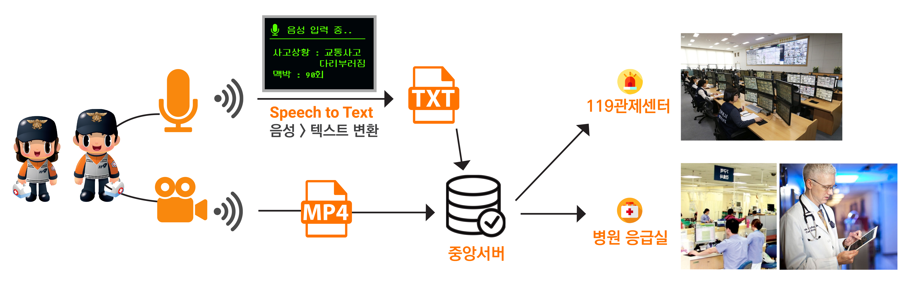

# 스마트 119 응급시스템 🚨

`기획` `개발` `디자인` 

응급환자의 골든타임 확보를 위한 Voice UX 기반 스마트 119 응급시스템 

## 개요 

1. #### 환자의 상태를 유관기관에 빠르고 정확하게 전달

2. #### 구조 활동 전반을 기록한 객관적인 자료 확보

응급환자의 구급상황은 작은 시간도 환자의 생명에 영향을 미칠 수 있다. 본 프로젝트에서는 응급상황에서 구급대원의 조끼에 부착된 기기를 통해 음성으로 상황을 기록하고 병원 및 119센터와 실시간으로 공유해 환자의 골든타임을 확보하는 시스템을 제안한다. 제안된 시스템은 과거 상황에 대한 객관성을 확보하고, 환자의 사후 처방을 보조하는 효과가 기대된다.

### 서비스 개요도

### 기획 개요

응급구조대의 구조활동에 편의를 더하는 음성입력 UX 적용

1. **구조대원의 음성입력으로 환자의 임상정보 기록**

   병원과 실시간으로 환자 임상정보 공유, 중앙DB에 저장되어 구급일지 자동기록

2. **구조활동 전반의 과정을 영상으로 촬영 및 기록**

   조끼에 장착된 카메라로 구조상황 상시 녹화

   구조사고 발생 시 객관적 판단을 위한 자료 제공

### 기술 개요

| 언어           | Python, JavaScript, HTML5, CSS3.0                            |
| -------------- | ------------------------------------------------------------ |
| 개발환경 (S/W) | (서버 & 웹) **AWS EC2 Linux** (데이터베이스) **AWS RDS MySQL** (디바이스) **Raspberry Pi OS** |
| 개발환경 (H/W) | (개발보드) **Raspberry Pi Zero W** (카메라) **RPI Camera NoIR** (마이크) **USB Microphone AT-815** |
| API            | Goolge STT(Speach-To-Text) API                               |

### 수상이력

🏆 **2018 스마트시티 서비스 및 창업  경진대회** (국토교통부 주관) : 최우수상(한국지역정보개발원장상 )수상

**🏆 ICT 스마트섬유 제품 아이디어  공모전** (한국섬유수출입협회 주관) : 우수아이디어상 수상

## 서비스

### 사용자 시나리오

### 응급구조대의 웨어러블 디바이스 (스마트조끼)

구급대원의 조끼에 **카메라**와 **마이크**를 결합한 웨어러블 디바이스

### 이송 중 환자의 임상정보 실시간 공유

구조대의 스마트 조끼로 디바이스로 수집한 환자정보를 유관기관과 실시간으로 공유

### 병원 모니터링 Dashboard

해당 병원 응급실로 이송 중인 환자의 임상정보를 한 눈에 확인할 수 있는 대시보드

병원은 환자의 상태를 신속하고 정확하게 파악하여 신속한 초동조치 준비

## 기술

### S/W 구성도

### H/W 구성도

### 데이터베이스 ERD

# 결과물

## 논문등재

